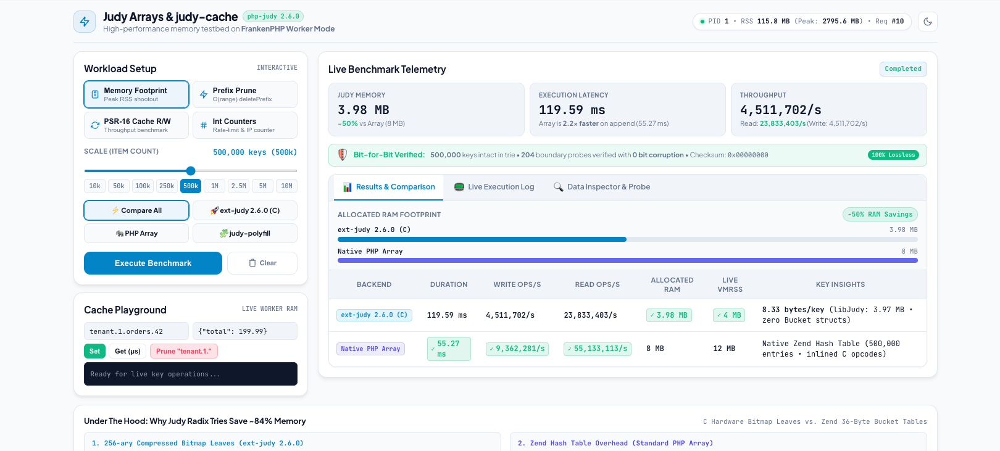

# FrankenPHP Live Worker Demo: judy-cache & php-judy 2.6.0

An interactive testbed running **FrankenPHP in persistent Worker Mode** with `php-judy 2.6.0`, `orieg/judy-cache`, and `orieg/judy-polyfill`.



## Features
- **FrankenPHP Worker Mode**: Shows true resident memory retention across HTTP requests.
- **Interactive Web UI**: Adjust workload parameters via live sliders ($10\text{k} \dots 10\text{M}$ items).
- **Interactive Memory Profiler**: Visual stacked diagrams decomposing resident worker memory into C Judy radix nodes, interned blob pools, Zend heap allocations, and system slab overhead.
- **Benchmarking & Validation Workloads**:
  - **Memory Footprint**: Direct peak RSS and bytes/key shootout (Native Judy vs. Standard PHP Arrays vs. Polyfill).
  - **Single-Trie vs. Dual-Trie**: Direct real-time comparison demonstrating the 50% index container memory reduction.
  - **Adaptive Compression**: Multi-KB JSON API & HTML document storage showing ~85% resident memory reduction.
  - **Payload Interning**: Content-addressable single-copy deduplication collapsing RAM by >90% on shared templates.
  - **Zero-Alloc TTL Pruning**: $O(1)$ cursor eviction sweeps maintaining flat heap memory during expirations.
  - **$\mathcal{O}(\text{range})$ Prefix Invalidation**: Benchmark `deletePrefix("tenant.1.")` sub-trie splices vs. $O(N)$ linear hashtable key scans.
  - **PSR-16 Cache Throughput**: Sustained read/write throughput tests.
  - **Integer Counters / Rate Limiting**: High-volume atomic integer increment workloads.
  - **Live Bit-for-Bit Integrity Verification**: Real-time CRC validation and boundary memory probes.

## Quickstart

From this directory:

```bash
docker compose up --build
```

Then open **[http://localhost:8080](http://localhost:8080)** in your browser.

## API Endpoints

- `GET /api/status`: Returns current worker PID, memory usage, request counts, and loaded extension versions.
- `GET /api/stream-benchmark`: Server-Sent Events (SSE) stream providing real-time telemetry and execution logs.
- `GET /api/memory-profiler?arch=single_trie`: Returns detailed memory layer breakdown across C Judy radix nodes, interned buffers, Zend heap, and slab overhead.
- `POST /api/benchmark`: Runs workload with JSON payload `{"count": 100000, "backend": "all", "workload": "memory_shootout"}`.
- `POST /api/clear`: Flushes resident worker cache and forces `gc_collect_cycles()`.
- `GET /api/verify-probe?key=...`: On-demand memory probe verifying data integrity directly in worker RAM.
